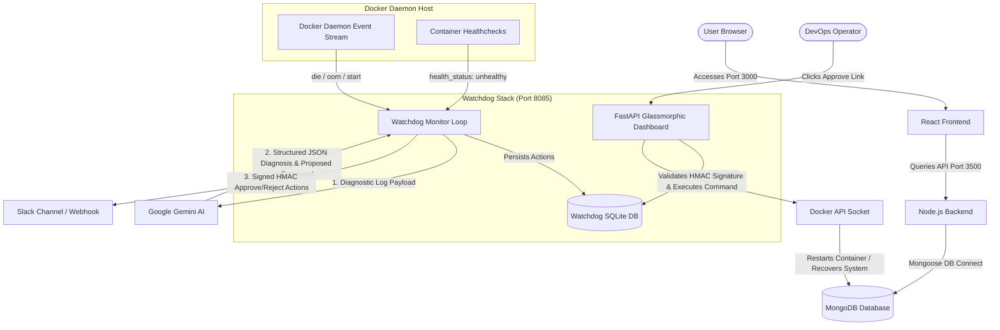

# 🚀 Three-Tier Application with AI-Powered Self-Healing Watchdog

A modern, production-grade three-tier containerized architecture equipped with an **AI Self-Healing Watchdog** powered by **Google Gemini**. The system automatically monitors container lifecycles and health states, diagnoses faults using generative AI log analysis, provides interactive human-in-the-loop Slack alerts, and serves a premium glassmorphic dark-mode dashboard for operational control.

---

## 📋 Table of Contents
1. [System Architecture](#-system-architecture)
2. [Key Features](#-key-features)
3. [Prerequisites](#-prerequisites)
4. [Environment Configuration](#-environment-configuration)
5. [Step-by-Step Deployment](#-step-by-step-deployment)
6. [Testing & Outage Simulation](#-testing--outage-simulation)
7. [Dashboard & Human-in-the-Loop Approval](#-dashboard--human-in-the-loop-approval)
8. [Project Structure](#-project-structure)

---

## 🏗️ System Architecture

The following diagram illustrates how the three-tier microservices, the Docker host daemon, Google Gemini, Slack, and the Self-Healing Watchdog interface with one another.



---

## ✨ Key Features

* **Three-Tier Microservices**:
  * **Frontend**: React-based responsive UI.
  * **Backend**: Node.js/Express REST API.
  * **Database**: MongoDB instance for persistent state.
* **AI-Powered Diagnostics**:
  * Captures container exit codes, termination signals, and stderr logs when an outage happens.
  * Utilizes Google Gemini's reasoning to output structured JSON diagnostic reports and remediation commands.
* **Dependency-Aware Remediation**:
  * Enforces container relationship constraints (e.g., Frontend depends on Backend; Backend depends on MongoDB).
  * If a service fails but its upstream dependency is already dead or restarting, remediation is **deferred** automatically to prevent restart-loop cascading failures.
* **Premium Glassmorphic Operations Dashboard**:
  * A dark-themed operations dashboard served at `http://localhost:8085/` utilizing Outfit typography, translucent panels, and real-time database state metrics.
* **Interactive Human-in-the-Loop alerts**:
  * Posts signed URLs to Slack for one-click manual approvals or rejections of proposed repair operations.
  * Expiration-backed HMAC signatures prevent URL tampering or unauthorized actions.
* **Structured JSON Logging**:
  * All watchdog runtime events, HTTP requests, and decision metrics are outputted as structured JSON lines for direct integration with log aggregators (e.g., Datadog, ELK stack).

---

## ⚙️ Prerequisites

Before getting started, make sure you have the following installed on your host system:
* **Docker Engine** (v20.10+)
* **Docker Compose** (v2.0+)
* **Slack Workspace** (with an active Incoming Webhook URL)
* **Google Gemini API Key** (Accessible from Google AI Studio)

---

## 🔧 Environment Configuration

Create or update the `.env` file in the root directory of the project with the following configuration:

```env
# Gemini Configuration
GEMINI_API_KEY=your_gemini_api_key_here

# Watchdog Dashboard Base URL
AGENT_URL=http://localhost:8085

# MongoDB Configuration
MONGO_USERNAME=admin
MONGO_PASSWORD=jojo@12

# Watchdog Configuration
WATCHDOG_SECRET=your_32_character_hex_secret_here
SLACK_WEBHOOK_URL=https://hooks.slack.com/services/your/webhook/path

# Alert Email Configuration (Optional fallback notifications)
ALERT_EMAIL=operator@example.com
SENDER_EMAIL=alerts@example.com
SENDER_PASSWORD=your_email_app_password
```

---

## 🚀 Step-by-Step Deployment

Follow these commands to deploy the entire stack locally:

### 1. Build Container Images
Build the custom Node.js backend, React frontend, and Python-based watchdog container images:
```bash
# Build the Node backend image
docker build -t three-tier-backend:latest ./backend

# Build the React frontend image
docker build -t three-tier-frontend:latest ./frontend

# Build the Python self-healing watchdog image
docker build -t three-tier-watchdog:latest ./watchdog
```

### 2. Start the Application Stack
Launch all components (Database, Backend, Frontend, and Watchdog) in detached mode using Docker Compose:
```bash
docker compose up -d
```

### 3. Verify Container Status
Check that all services are running and the backend/frontend containers are reporting `healthy`:
```bash
docker compose ps
```
You should see:
* `three-tier-db` listening on port `27017`
* `three-tier-backend` listening on port `3500` (healthy)
* `three-tier-frontend` listening on port `3000` (healthy)
* `ai-watchdog` listening on port `8085` -> `8080` (healthy)

---

## 🧪 Testing & Outage Simulation

You can verify the self-healing, log analysis, and dependency-aware logic by simulating database and backend outages.

### Outage Test 1: Core Database Failure (Watchdog Log Analysis)
1. Gracefully stop the database container:
   ```bash
   docker compose stop database
   ```
2. Check the watchdog container logs:
   ```bash
   docker compose logs ai-watchdog | tail -n 20
   ```
   You will see the watchdog intercepting the `die` event for `three-tier-db` and posting a structured log entry.
3. Check your Slack channel:
   An alert will appear containing:
   * **Diagnosis**: Gemini's explanation (e.g. *SIGTERM Signal 15 received, graceful shutdown requested*).
   * **Proposed Command**: `docker restart three-tier-db`
   * **Approve / Reject URLs**: Hyperlinks to apply the fix or ignore it.

### Outage Test 2: Dependency-Aware Deferral Loop
1. With the database container still **stopped**, verify that the backend's `/ok` endpoint starts failing (due to the active `mongoose.connection.db.admin().ping()` check).
2. Wait up to 30 seconds for Docker to mark `three-tier-backend` as `unhealthy`.
3. Check the watchdog logs again:
   ```bash
   docker compose logs ai-watchdog | grep "REMEDIATION DEFERRED"
   ```
   The watchdog will print:
   ```json
   {"timestamp": "...", "level": "WARNING", "message": "[REMEDIATION DEFERRED] Service 'three-tier-backend' cannot be recovered: Dependency 'three-tier-db' is not running (status: exited).", "logger": "ai_watchdog"}
   ```
   *Explanation*: The watchdog automatically checks if the database is running before restarting the backend. Because the database is stopped, it defers restarting the backend to avoid endless retry loop fatigue.
4. Restart the database:
   ```bash
   docker compose start database
   ```
   Once MongoDB is back online, the backend's health check returns to `healthy` automatically.

---

## 📊 Dashboard & Human-in-the-Loop Approval

Access the dynamic web console in your browser:
* **URL**: `http://localhost:8085/`

### Features:
1. **Interactive Metrics**: Displays Total Incidents, Pending Approvals, Recoveries Executed, and Bypassed failures.
2. **Detailed Incident Log**: Tabulates container names, generative AI diagnoses, proposed scripts, timestamps, and active status badges.
3. **Execution Controls**: Action buttons let operators click **Approve** (executes the Docker command instantly and updates the UI state) or **Reject** (marks the action as bypassed).
4. **Link Integrity Protection**: Approval links are protected via cryptographic HMAC signatures:
   `http://localhost:8085/approve/{action_id}?signature={hash}&expires={epoch_timestamp}`

---

## 📁 Project Structure

```text
Application-Code/
├── backend/               # Node.js backend server code
│   ├── db.js              # Mongoose DB connection & lifecycle logic
│   ├── index.js           # REST routes & db connection ping healthcheck
│   └── Dockerfile
├── frontend/              # React frontend application
│   ├── src/
│   └── Dockerfile
├── watchdog/              # AI Watchdog Service
│   ├── watchdog.py        # Event listener, FastAPI dashboard, & Gemini API integration
│   └── Dockerfile
├── .env                   # Local secrets & webhook configurations
└── docker-compose.yml     # Multi-container service definitions & healthchecks
```
